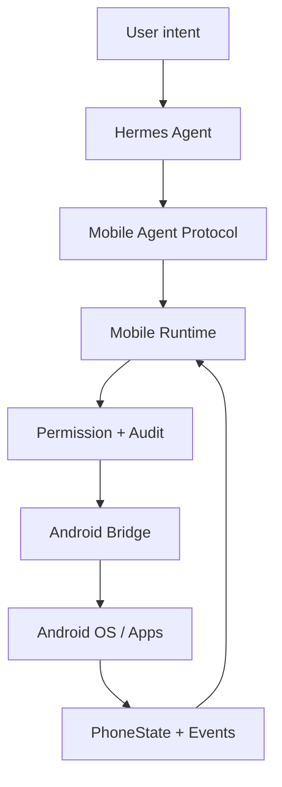
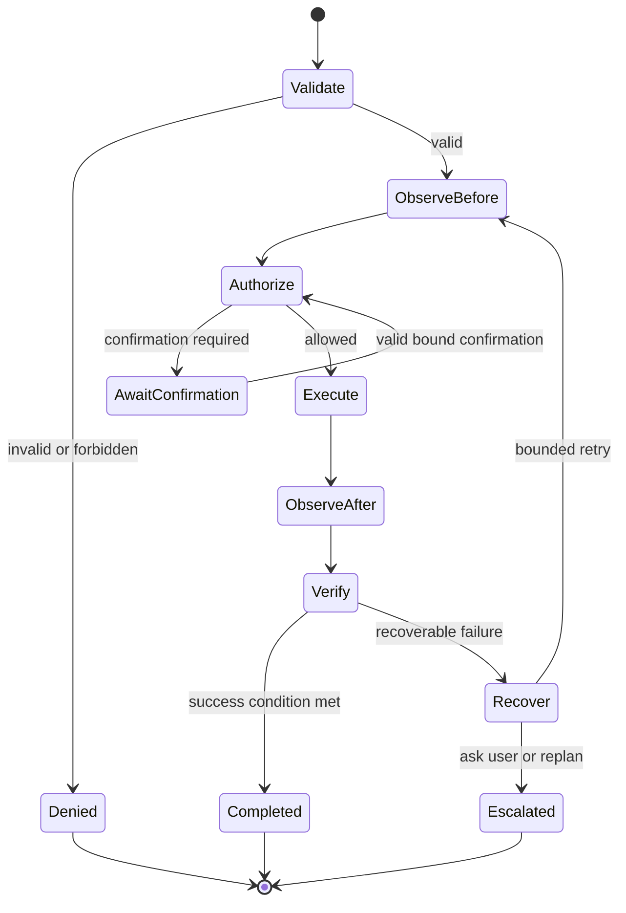

# Hermes Mobile Runtime Architecture

> Status: Phase 0 proposed architecture  
> Last reviewed: 2026-08-28  
> No production implementation exists in the current workspace.

## 1. Decision

Hermes Mobile Runtime will be built by **forking [`NousResearch/hermes-agent`](https://github.com/NousResearch/hermes-agent) as the primary repository** while keeping the fork delta small. Android execution primitives will be adapted from [`raulvidis/hermes-android`](https://github.com/raulvidis/hermes-android) with upstream provenance, not copied as an untracked code dump.

The full evidence and comparison are in [`docs/research/open-source-comparison.md`](docs/research/open-source-comparison.md).

This decision separates two responsibilities:

- Hermes Agent remains the control plane: intent, planning, model routing, tools, Skills, Memory, MCP, scheduling and user channels.
- Hermes Mobile Runtime becomes the protected execution plane: protocol, observation, permission enforcement, Android capabilities, verification, recovery and audit.

## 2. Goals

- Expose stable `phone.*` tools without leaking Accessibility implementation details into Hermes.
- Enforce Observe → Decide → Act → Observe → Verify for state-changing operations.
- Make Permission Gate and Audit impossible to bypass through raw tools, Skills, MCP or recovery paths.
- Prefer Native API → Intent → Semantic Accessibility → Vision → Coordinates.
- Support deterministic errors, bounded recovery and human escalation.
- Allow successful, repeatedly validated traces to become versioned Mobile Skills.
- Keep upstream Hermes upgrades feasible.

## 3. Non-goals for V0.1

- Arbitrary Shizuku or shell execution.
- Payment, transfer, APK installation or security-setting changes.
- Permanent Skill Learning from one successful trace.
- Vision-first automation or broad support for dozens of apps.
- Running the full Hermes planner inside the Android app.
- Treating prompt instructions as a security boundary.

## 4. Architectural invariants

1. Every action enters through Tool Router.
2. Every action is evaluated by Permission Gate before Android execution.
3. The Android bridge independently enforces the signed/authorized decision; server-side policy alone is insufficient.
4. State-changing actions have before and after observations plus an explicit verification result.
5. Action acceptance is not task success.
6. Recovery cannot increase permission level or change confirmed parameters.
7. Retries are bounded by count, deadline and risk budget.
8. Screen, notification, clipboard, contact, location and recording data are sensitive artifacts, not ordinary log strings.
9. Protocol types do not expose `AccessibilityNodeInfo`, Android service instances or transport-specific objects.
10. No raw bridge endpoint is reachable by Hermes, MCP servers or Skills.

## 5. System context



The logical deployment has two trust domains:

- **Agent host:** Hermes Agent, Mobile Runtime server components, policy configuration and encrypted audit store.
- **Android device:** bridge app, Accessibility/Notification services, native Intent/API adapters and the device-side Policy Enforcement Point.

Transport must be authenticated, encrypted and replay-resistant. Development-only local transports may exist behind an explicit insecure build flag and must not be enabled in release builds.

## 6. Components

| Component | Responsibility | Must not do |
|---|---|---|
| Hermes Planner | Understand intent and propose plans/tools/Skills | Call Android endpoints directly or grant itself permissions |
| Mobile Agent Protocol | Versioned request/result/event/state contracts | Contain Android service objects or business policy |
| Tool Router | Resolve tool, validate schema, create execution context | Execute before Gate decision |
| Permission Gate | Classify L0–L5, apply user policy, issue confirmation decision | Depend on model prose as authorization |
| State Observer | Produce coherent `PhoneState`, hashes and transitions | Mutate the device |
| Verification Engine | Evaluate action/Skill success conditions | Infer success solely from executor `success=true` |
| Recovery Engine | Classify failure and select bounded recovery | Retry forever, change recipient/body/amount or bypass Gate |
| Event Bus | Normalize, dedupe, persist cursors, apply sensitivity/backpressure | Automatically execute high-risk actions |
| Skill Registry | Store versioned, permission-aware validated Mobile Skills | Promote one trace directly to high confidence |
| Audit | Link intent, plan, calls, states, permissions, errors and result | Persist raw sensitive content by default |
| Android Capability Layer | Accessibility, screenshot, notifications, Intent/native APIs | Decide business permissions or planning |
| Android PEP | Validate device/session/action authorization immediately before execution | Trust a tool name without a policy decision |

## 7. Action lifecycle



The audit span begins at validation and ends only after verification, denial or escalation. A timeout must terminate the current attempt and produce a typed result; it cannot silently continue in the background.

## 8. Protocol V0.1

V0.1 exposes only:

- `phone.read_screen`
- `phone.screenshot`
- `phone.tap`
- `phone.long_press`
- `phone.type`
- `phone.swipe`
- `phone.back`
- `phone.home`
- `phone.open_app`
- `phone.wait`
- `phone.notifications`
- `phone.current_app`
- `phone.device_state`

Every result contains at least the user-required fields plus correlation and verification metadata:

```text
protocol_version
request_id / task_id / span_id / device_id
tool / parameters
execution_status
before_state / after_state
duration
error / recoverable / attempt
permission_decision_id
verification
artifacts / redactions
timestamp
```

`before_state` and `after_state` are references and summaries. Full screenshots/UI trees are protected artifacts with retention and access controls.

### 8.1 Result separation

- `ExecutionResult`: Android accepted/completed the low-level action.
- `VerificationResult`: the observed postcondition matches the requested action or Skill success condition.
- `TaskResult`: the user goal is complete, incomplete, denied or escalated.

These types must not collapse into one boolean.

### 8.2 Error taxonomy

Initial stable classes:

- `TRANSPORT_UNAVAILABLE`
- `AUTHENTICATION_FAILED`
- `PROTOCOL_INCOMPATIBLE`
- `PERMISSION_DENIED`
- `CONFIRMATION_REQUIRED`
- `CAPABILITY_UNAVAILABLE`
- `APP_NOT_FOUND`
- `NODE_NOT_FOUND`
- `ACTION_REJECTED`
- `ACTION_TIMEOUT`
- `STATE_UNCHANGED`
- `UNEXPECTED_TRANSITION`
- `APP_CRASHED`
- `NETWORK_UNAVAILABLE`
- `VERIFICATION_FAILED`

Errors include a recoverability classification and must not expose secrets or unredacted screen content.

## 9. PhoneState

The minimal coherent state is:

```text
state_id / captured_at / device_id
foreground_app / activity
ui_hierarchy_ref / visible_text_summary
clickable_nodes / focused_element
keyboard_state / dialogs
notification_cursor / notification_changes
screenshot_ref / screenshot_hash
screen_transition
device_state
capture_errors / redactions
```

State capture should be as atomic as Android allows. Each field records freshness; callers must not combine a stale tree with a new screenshot without marking the skew.

## 10. Permission architecture

Policy has two enforcement points:

1. Runtime PDP evaluates intent, parameters, user policy and current context.
2. Device PEP validates the decision, expiry, device, request hash and confirmation binding immediately before capability execution.

L0–L5 policy is defined in [`SECURITY.md`](SECURITY.md). A Skill declares required permissions but cannot lower them. Recovery repeats the original permission decision only when the action hash and risk context remain unchanged.

## 11. Event and Skill boundaries

`MobileEvent` carries `id/type/source/timestamp/payload/sensitivity`. Event ingestion is separated from action execution. An event may produce `ignore/respond/execute_skill/start_task/ask_user`, but the selected action still enters Tool Router and Permission Gate.

Mobile Skills include parameters, preconditions, steps, success/failure conditions, permissions, supported app versions, recovery, confidence and evidence. Skill promotion requires parameterization, repeated validation and rollback/versioning.

## 12. Recommended repository structure

```text
apps/mobile-bridge-android/
hermes_mobile/
  protocol/
  runtime/
  tools/
  observer/
  permissions/
  events/
  skills/
  memory/
  recovery/
  audit/
  android/
tests/mobile/{unit,contract,emulator,fixtures,security}/
docs/{research,protocol,tools,skills,adr,testing}/
third_party/notices/
```

If Hermes tool discovery requires a root `tools/` entry, it is a thin registration shim only. New mobile logic stays inside `hermes_mobile/` to reduce upstream conflicts.

## 13. Testing architecture

- Pure unit tests for schema, policy, state diff, error and recovery decisions.
- Python/Kotlin golden contract fixtures for protocol compatibility.
- Fake Android capability provider for deterministic Runtime tests.
- Emulator tests for installation, service lifecycle, grant/revoke, UI tree, screenshot and gestures.
- Chaos fixtures for slow pages, dialogs, keyboard obstruction, element changes, disconnects and app crashes.
- Real-device compatibility matrix across Android API and at least one non-Pixel OEM.
- Security tests for replay, expired confirmation, bypass attempts, malicious node text and artifact leakage.
- AndroidWorld-style task checkers for durable success signals.

## 14. Required ADRs before implementation expands

- ADR-0001: Repository composition and upstream boundaries.
- ADR-0002: Mobile Agent Protocol V0.1.
- ADR-0003: Permission Gate enforcement.
- ADR-0004: PhoneState consistency and artifact storage.
- ADR-0005: Device identity, transport and key rotation.
- ADR-0006: Error taxonomy and bounded recovery policy.

Phase 1 may bootstrap only enough code to validate ADR-0001–0003 and the `phone.current_app` vertical slice. See [`ROADMAP.md`](ROADMAP.md).

