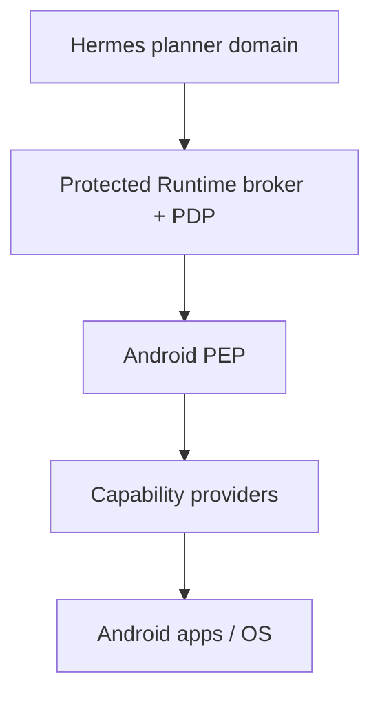
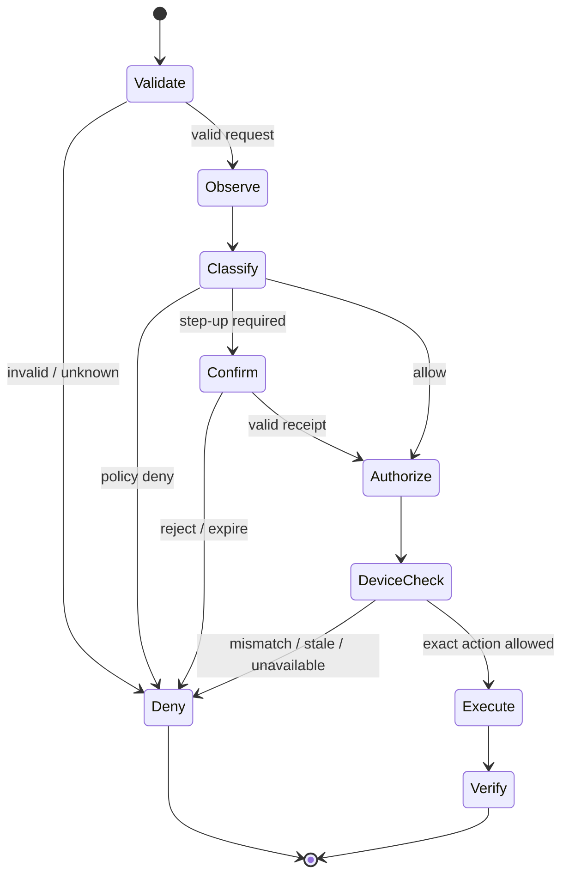

# ADR-0003: Executor-Enforced Permission Gate

- Status: Proposed
- Date: 2026-08-28
- Decision owners: Hermes Mobile Runtime maintainers
- Phase: 1 / HMR-005

## Context

Hermes Agent deliberately treats the operating system, not an in-process
approval function, as the security boundary against adversarial model output.
Mobile Runtime also loads or consumes Skills, plugins, MCP results, web/UI text
and notifications. Any of those inputs may be compromised or prompt-injected.

An in-process Python `if approved:` check would therefore be bypassable by a
malicious extension with agent-process privileges. A server-only decision
would also be ineffective if Android accepted raw commands. The project needs
a concrete isolation boundary, an authenticated confirmation channel and an
Android-side enforcement point before device-control code is imported.

## Decision

### 1. Three trust domains

1. **Hermes planner domain:** the Python agent and its Skills, plugins, MCP
   servers and model/provider inputs are untrusted requesters for mobile
   authority.
2. **Protected Runtime broker domain:** a separately launched OS process under
   a dedicated service identity owns policy state, confirmation state, audit
   writer access and policy-signing access.
3. **Android execution domain:** the bridge's Policy Enforcement Point (PEP)
   verifies the authorization again immediately before dispatch to a narrow
   capability provider.

The broker is not imported into the Hermes interpreter. It exposes a typed,
minimal RPC interface, not a general Python/plugin API, shell, file API, URL
proxy or signing method.

### 2. Host process isolation and local IPC

Production deployments run Hermes with whole-process OS isolation when it
consumes untrusted input. The Runtime broker runs outside that sandbox under a
separate OS identity. The planner sandbox receives only the broker client
endpoint and a scoped requester credential; it cannot read broker storage,
device credentials, confirmation keys, audit keys or the policy signing key.

The local IPC transport is selected per host:

- Unix-like hosts use an absolute-path Unix domain socket inside a
  broker-owned directory with explicit ACLs and OS peer-credential checks.
- Windows hosts use a named pipe with an explicit service/user ACL and client
  token validation.

After the OS peer check, both sides perform a challenge-response handshake
with a per-install requester credential from the host credential store and
derive a short-lived session. Each RPC is integrity-bound to the session,
sequence and deadline. Loopback TCP is not the default local boundary. If a
remote broker is later supported, it uses the ADR-0005 device-grade mutual TLS
profile rather than weakening this decision.

The requester credential authenticates the Hermes instance; it does not grant
an operation. A compromised planner may ask for actions, but only the broker
can evaluate policy or issue an execution authorization.

### 3. Key separation

The following authorities are distinct:

| Secret/authority | Owner | Exposed to planner? |
|---|---|---|
| Broker requester credential | Scoped client credential store | Yes, only through the client IPC library |
| Device transport/session keys | Broker + enrolled Android device | No |
| Policy signing key | Broker protected key service/store | No |
| Confirmation signing/device-auth key | Trusted presenter or Android Keystore | No |
| Audit integrity key | Trusted audit writer | No |

The policy signer accepts only a fully evaluated internal `PolicyDecision` and
normalized action digest. It is not a generic sign-bytes API. Cryptographic
algorithms, enrollment and rotation are finalized by ADR-0005; no symmetric
authorization secret is shared with the planner.

### 4. Mandatory authorization flow

Every action follows this order:

1. Broker authenticates caller and validates the closed request schema.
2. Observer supplies a fresh before-state and target claim.
3. Broker resolves semantic effect and computes effective L0–L5 risk.
4. PDP evaluates hard policy, user policy and contextual constraints.
5. If required, a trusted presenter displays an exact action preview and
   returns an authenticated, parameter-bound confirmation receipt.
6. Broker commits the required pre-execution audit record.
7. Broker issues a short-lived `ExecutionAuthorization` and sends it directly
   to the enrolled Android device.
8. Android PEP recomputes the action digest and rechecks authorization,
   capability, Android permission, lock state, target semantics and state
   precondition.
9. Capability executes once; Observer captures after-state and Verifier
   evaluates the postcondition.

There is no raw or debug endpoint that skips these steps in a release build.
Test fakes implement the same PEP interface and cannot be selected by release
configuration.

### 5. Risk classification

The effective level is the maximum of primitive baseline, semantic effect,
target/app policy, parameter sensitivity, Skill declaration and user policy.
A Skill declaration is a lower bound, never an authority to reduce risk.

| Level | Minimum policy | V0.1 examples |
|---:|---|---|
| L0 Read | Allow after data/capability policy | Read screen, screenshot, notifications, current app, device state, bounded wait |
| L1 Navigation | Allow while unlocked and target policy permits | Open app, back, home, swipe, ordinary navigation tap |
| L2 Modify | User-configurable allow/confirm; default confirm on unknown target | Type a draft, change an ordinary non-security setting |
| L3 Communication | Confirmation required for every final external effect | Tap Send, publish, email, comment, place a call |
| L4 Destructive / financial | Confirmation plus device authentication; capability absent in V0.1 | Delete data, purchase, payment, transfer |
| L5 System | Confirmation plus device authentication; capability absent in V0.1 | APK install, security settings, privileged Shizuku/Shell |

User policy may make a level stricter but cannot remove the hard L3–L5
confirmation minimum. Shizuku, Shell, APK installation, arbitrary Intent,
payment and transfer providers are not compiled into the V0.1 release surface.

### 6. Semantic risk resolution

Tool name alone is insufficient. Before execution, the broker and Android PEP
resolve the likely effect using the freshest available package, window,
semantic node, role, label, bounds and surrounding state.

Mandatory upgrades include:

- **Send / Post / Publish / Call** → at least L3;
- **Delete / Uninstall / Purchase / Pay / Transfer** → at least L4;
- **Install / Accessibility / Device admin / security setting / privileged
  command** → L5;
- credential, OTP, authenticator, password-manager and banking surfaces →
  deny or explicit step-up policy.

If a coordinate or node could have drifted onto a higher-risk target, Android
PEP returns `RISK_UPGRADE_REQUIRED` before performing the gesture. Unknown
critical semantics fail closed. Merely renaming the primitive to `tap` or
placing it inside a Skill does not avoid classification.

### 7. PolicyDecision

The protected PDP emits one of `ALLOW`, `DENY` or `REQUIRE_CONFIRMATION` with:

- `decision_id`, `policy_version` and policy digest;
- authenticated requester/session and task/request ids;
- device id, canonical tool and action digest;
- resolved semantic effect and effective risk;
- constraints such as package, target, foreground, lock state and freshness;
- reason codes, issue/expiry times and required confirmation strength;
- audit-precondition state.

The planner receives a safe projection of the outcome and reason. It does not
receive an editable decision object, signer handle or unsigned authorization
template.

### 8. Trusted confirmation

A model message, tool parameter, notification, Skill step or Hermes approval
string is never confirmation evidence.

V0.1 L3 confirmations are presented on an allowlisted native surface outside
the planner's control, with the enrolled Android device as the default
presenter. While that surface is active, Android PEP rejects Mobile Runtime
Accessibility gestures and text input rather than relying only on node hiding;
the bridge also excludes the surface from observation artifacts. The user must
perform an explicit physical confirmation. Rejection, dismissal, lock or
timeout denies the action. A broker-owned native host presenter may be
supported only when it is also outside the planner sandbox and cannot be
driven through Hermes tools.

The preview shows the exact action, app, destination/recipient and content or
other material parameters. It clearly distinguishes **prepare/draft** from the
final external effect.

A valid `ConfirmationReceipt` binds:

- confirmation/challenge nonce;
- user/task/request and device ids;
- canonical tool, exact action digest and effective risk;
- preview digest and trusted presenter identity;
- issue/confirmation/expiry times;
- authentication strength and one-time-use state.

The challenge expires in at most five minutes. After confirmation, the
execution authorization expires in at most 30 seconds and is single-use.
Configuration may shorten but not lengthen either V0.1 maximum. Any material
parameter, semantic target, package, stable target precondition or risk change
invalidates the receipt. A new overall `state_id` caused only by opening and
closing the trusted confirmation surface is not itself a material change; PEP
must still prove that the bound package/window/target fingerprint and freshness
constraints match before execution.

L4/L5 are absent in V0.1. A future ADR must require supported device
authentication or Android Protected Confirmation where available; an ordinary
button is insufficient for those levels.

### 9. ExecutionAuthorization

The broker creates a signed, opaque authorization containing at least:

- authorization and decision ids;
- protocol version and policy version;
- issuer, enrolled device and authenticated session ids;
- request id, idempotency key and action digest;
- effective risk and exact constraints;
- confirmation receipt digest when required;
- nonce/sequence, issue time, expiry and allowed execution count of one;
- signing key id and algorithm.

It is delivered broker-to-device and never returned to Hermes, a Skill, MCP or
normal audit content. Audit stores identifiers and digests, not the reusable
credential.

### 10. Android PEP checks

Immediately before capability invocation, Android PEP must:

1. validate protocol/session and trusted issuer;
2. validate signature, device, request, action digest, expiry and sequence;
3. atomically consume or reserve the nonce/idempotency entry;
4. compare actual canonical parameters and state precondition;
5. confirm required Android permission/service/capability still exists;
6. apply lock-screen, sensitive-app, foreground-package and target-window
   policy;
7. re-resolve target semantics and reject any risk increase;
8. ensure required pre-execution audit acknowledgment exists;
9. dispatch only to the capability provider named by the canonical operation.

The stricter Runtime/Android decision wins. Android never downgrades risk or
executes because the Runtime is unreachable. A restart, reconnect or restored
backup does not reset replay protection into an allow state.

### 11. Audit and failure behavior

Every decision records normalized parameter digest, risk, policy version,
reason, requester, device, state ids and outcome. Confirmation records contain
receipt metadata and digests but not D4 secrets. Audit text supplied by an
untrusted caller is stored as labeled data, never as a trusted reason.

L3–L5 fail closed if the trusted audit writer cannot commit the required
pre-execution record. Policy may also require fail-closed audit for D3 reads.
L0–L2 failures that are permitted to continue record a signed local gap marker
for later reconciliation; they do not silently claim complete audit.

Required policy/security error codes include:

- `PERMISSION_DENIED`
- `CONFIRMATION_REQUIRED`
- `CONFIRMATION_REJECTED`
- `CONFIRMATION_EXPIRED`
- `CONFIRMATION_INVALID`
- `AUTHORIZATION_INVALID`
- `AUTHORIZATION_EXPIRED`
- `REPLAY_DETECTED`
- `ACTION_MISMATCH`
- `RISK_UPGRADE_REQUIRED`
- `DEVICE_LOCKED`
- `AUDIT_UNAVAILABLE`

These errors are non-recoverable unless the prescribed next step is a fresh
observation, new policy evaluation or new user confirmation. Recovery cannot
edit or reuse a decision.

### 12. Recovery and ambiguous outcomes

Recovery re-enters the broker as a new policy evaluation. It may reuse the
same idempotency key only for an identical action digest and a broker-approved
same-action retry. Any parameter, target, package, state or risk change creates
a new action digest and invalidates prior confirmation.

After an ambiguous communication/destructive/system outcome, Runtime queries
the replay/result cache and re-observes. It asks the user rather than
automatically repeating the action. Retry count, deadline and risk budgets are
specified in ADR-0006.

### 13. Operational recovery and break glass

If broker policy, key store, audit writer or device trust state is unavailable,
the broker denies protected operations. There is no runtime flag to bypass the
Gate. Development-only insecure fixtures require a test build, an isolated
test trust root and a visible audit marker; they cannot enroll a production
device.

Device unlink/revoke uses a management channel independent of the active
device session. Lost-device response revokes enrollment and broker sessions;
it does not depend on asking the possibly compromised planner to forget a key.

## Rejected alternatives

### In-process Python gate

Rejected because Skills/plugins execute in the Hermes process and an
adversarial process cannot contain itself.

### Android-only permission checks

Rejected because Android runtime permissions authorize an app capability, not
the user's exact recipient, message, target, risk or current intent.

### Runtime-only policy

Rejected because leaked transport credentials or a raw endpoint could bypass
the server after the decision.

### Prompt-based approval

Rejected because model output and observed content are untrusted strings, not
authenticated user presence.

### Reusable approval by app or Skill

Rejected because it permits parameter substitution and privilege laundering.
Confirmations bind one exact action and expire.

### Generic signed bytes API

Rejected because a compromised planner could obtain a valid signature over an
unevaluated action.

## Consequences

### Positive

- Compromise of the Hermes planner process does not expose the policy signing
  or Android device credentials.
- Android independently denies changed, stale, replayed or under-classified
  actions.
- Final communication is visibly distinct from drafting.
- Skills, MCP and recovery share the same mandatory path.

### Costs

- The product requires a managed broker service and host-specific IPC setup.
- Confirmation adds latency to L3 and future L4/L5 actions.
- Device and broker need replay state, clock/error handling and key lifecycle.
- Semantic ambiguity often causes a safe denial or user question.

## Required verification

Before Phase 1 exit, tests must prove:

| Threat | Required test |
|---|---|
| HMR-T002 | Hermes tool, Skill, plugin and MCP cannot reach a raw device route or signer |
| HMR-T003 | Tap on Send/Delete/Pay is upgraded or denied before execution |
| HMR-T004 | Model-supplied `confirmed=true` and approval prose are rejected |
| HMR-T005 | Replay, wrong device, expired receipt and one-field mutation fail |
| HMR-T006 | Recovery target/body/package change requires a new decision |
| HMR-T008 | Disconnect/retry executes an idempotent action at most once |
| HMR-T012 | Layout/overlay target drift is rejected at Android PEP |
| HMR-T024 | L3 action fails closed on audit precommit failure |
| HMR-T025 | Android permission revoked just before dispatch returns typed denial |
| HMR-T028 | Disallowed operation while locked is denied |

An end-to-end test must prepare a message without L3 confirmation, require a
trusted confirmation for the final Send action, reject a mutated body, then
verify and audit exactly one send.

## Follow-up decisions

- ADR-0004: PhoneState consistency, target generation and artifact storage.
- ADR-0005: Device enrollment, transport, algorithms and key rotation.
- ADR-0006: Error taxonomy, retry budgets and ambiguous-outcome recovery.
