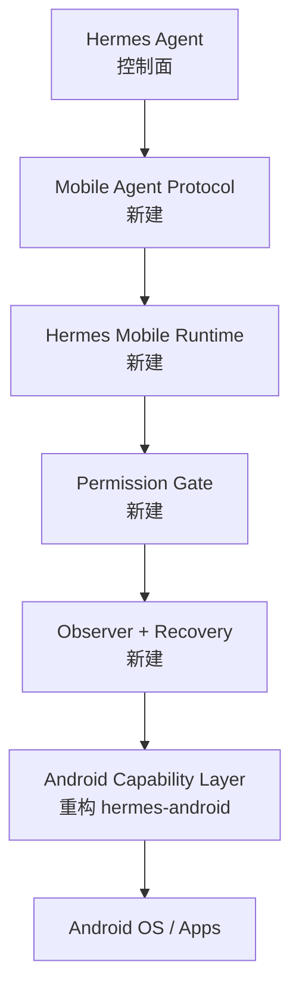

# Hermes Mobile Runtime：开源项目技术审计

> Phase 0 / Open Source Audit  
> 审计快照：2026-08-28（UTC）  
> 状态：架构选型建议；不构成法律意见

## 1. 结论先行

### 1.1 推荐

- **Primary Base Repository：[`NousResearch/hermes-agent`](https://github.com/NousResearch/hermes-agent)**。
  它应继续承担 Agent 控制面：意图理解、Planner/Agent Loop、模型路由、Tool Registry、Skills、Memory、MCP、定时任务与消息网关。不要在 Android 端复制这些能力。
- **Primary Android Execution Baseline：[`raulvidis/hermes-android`](https://github.com/raulvidis/hermes-android)**。
  它是与 Hermes 直接集成、同时公开 Kotlin Accessibility bridge 源码的最接近候选。复用其原生能力实现，但不继承其现有安全模型、宏执行模型和返回协议。
- **Secondary Reference Repositories：**
  - [`droidrun/mobilerun`](https://github.com/droidrun/mobilerun)：Accessibility + screenshot、agent trace、app cards、macro/state 设计参考；Portal APK 的源码/许可证边界确认前不得直接纳入产品。
  - [`google-research/android_world`](https://github.com/google-research/android_world)：任务夹具、动态任务、durable reward/checker、可重复测试环境。
  - [`X-PLUG/MobileAgent`](https://github.com/X-PLUG/MobileAgent)：长任务规划、反思、自进化和视觉回退研究参考。
  - [`zai-org/Open-AutoGLM`](https://github.com/zai-org/Open-AutoGLM)：VLM 屏幕理解、敏感操作确认、人类接管、国产 App 覆盖参考。
  - [`CursorTouch/Android-MCP`](https://github.com/CursorTouch/Android-MCP)：紧凑 MCP tool surface、UI tree 与截图并行抓取参考。
  - [`Hy4ri/hermes-mobile`](https://github.com/Hy4ri/hermes-mobile)：Hermes 原生 Android 管理/聊天 UI 的二级参考。
- **不作为代码基础：[`DarkWingStudio/hermesapp`](https://github.com/DarkWingStudio/hermesapp)**。当前公开仓库只有 README 与 LICENSE，功能描述是路线图而不是可复用实现。

### 1.2 核心判断

没有一个候选仓库同时具备本项目要求的统一 Tool Protocol、强制 Permission Gate、Observe–Act–Verify 闭环、有限 Recovery、标准化 Event Bus、可验证 Skill Learning 和完整 Audit。因此正确路线不是“选择一个 Android 自动点击器继续堆功能”，而是：

1. 以 Hermes Agent 作为控制面主干；
2. 从 hermes-android 提取 Android 原生 capability；
3. 在二者之间新建稳定的 Mobile Agent Protocol 与安全 Runtime；
4. 以 Mobilerun/MobileAgent/Open-AutoGLM 作为算法和工程模式参考；
5. 以 AndroidWorld 风格的可验证任务作为验收骨架。

### 1.3 复用、重写与移除

| 决策 | 模块 | 来源/处理 |
|---|---|---|
| 复用 | Agent loop、provider routing、tool/plugin registry、Skills、Memory、MCP、cron/gateway | Hermes Agent；尽量保持上游兼容 |
| 复用后重构 | AccessibilityService、UI tree reader、tap/type/gesture、screenshot、foreground app、NotificationListener、Intent、设备能力、outbound WebSocket | hermes-android；置于 `android/` capability 边界后面 |
| 新写 | Mobile Agent Protocol、Tool Router、State Observer、Permission Gate、Event Bus、Recovery Engine、Audit、Skill validation/learning | 本项目核心差异化能力 |
| 参考实现 | trace/telemetry、UI state formatting、vision fallback、reflection、task checker | Mobilerun、Android-MCP、MobileAgent、Open-AutoGLM、AndroidWorld |
| 移除/禁用 | `android_macro` 直接顺序执行；默认暴露 SMS/电话/广播/任意 Intent/麦克风/位置/剪贴板；重复维护的 Python tool 文件；明文公网 relay | 用 Runtime 编排与 Permission Gate 替代；高风险能力只能经 Gate 注册 |
| 暂缓 | Shizuku/Shell、永久 Skill Learning、全量事件主动执行、支付/安装能力 | 分别推迟到 Permission Gate、Audit 和设备认证完成之后 |

## 2. 审计范围与方法

本次工作区为空目录且不是 Git 仓库；没有 `ARCHITECTURE.md`、ADR、已有源码或构建配置可审阅。因此本阶段只生成研究文档，没有进行 Runtime 重构或伪造“当前实现”。

审计以候选仓库默认分支上的 LICENSE、README、安全文档和关键源码为主要证据。结论分为：

- **已实现**：在公开源码中找到对应实现；
- **项目声明**：README/文档声称支持，但本次未完成设备实测；
- **计划中**：只有 roadmap；
- **未发现**：在本次审计范围内没有找到公开实现，不等价于绝对不存在。

Stars、forks、commits 是 2026-08-28 附近的 GitHub 页面快照，会持续变化；本文使用约数。GitHub 未登录页面没有稳定返回每个仓库的 contributor 总数，所以“贡献者”一栏只记录可核验信号，不用 commit author 数冒充 contributor 数。正式引入依赖时必须将仓库、commit SHA、LICENSE hash、NOTICE、依赖树和构建产物写入 SBOM。

本轮还直接复核了 GitHub 的 commit、Issues、tests 与 CI：Hermes Agent 在 2026-08-28 的 commit 历史中仍连续合入模型、cron、安全、性能与测试修改，说明上游非常活跃，但也意味着长期 fork 的合并成本高；其公开 Issues 同时存在安装兼容、gateway outage、MCP handshake 等问题。hermes-android 当前公开 Issues 很少，但这不能替代覆盖率；其 CI 会运行 `testDebugUnitTest` 并构建 debug APK，顶层 Python tests 覆盖 relay 与 tool，尚未看到真实设备/OEM 端到端验证。相关证据见 [Hermes commits](https://github.com/NousResearch/hermes-agent/commits/main)、[Hermes issues](https://github.com/NousResearch/hermes-agent/issues)、[hermes-android tests](https://github.com/raulvidis/hermes-android/tree/main/tests) 与 [Android build workflow](https://github.com/raulvidis/hermes-android/blob/main/.github/workflows/build.yml)。

## 3. 候选总览

| 项目 | License | 维护信号 | Stars / Forks / Commits（约） | 贡献者信号 | 定位 | 结论 |
|---|---|---:|---:|---|---|---|
| Hermes Agent | MIT | 2026-08-28 仍有 push；活跃 | 237k / 48k / 未稳定返回 | 多维护者/大规模社区 | 通用 Agent 控制面 | **主仓库** |
| hermes-android | MIT | 141 commits、仍有 PR；活跃原型 | 480 / 74 / 141 | 核心维护者 + 外部 PR | Hermes Android 执行桥 | **原生执行基线** |
| HermesApp | MIT | 6 commits；Phase 1 未完成 | 3 / 0 / 6 | 至少 1 | 设想中的本地 AI UI | 不采用 |
| hermes-mobile | Apache-2.0 | 713 commits；近期发布 | 86 / 23 / 713 | 活跃社区信号 | Hermes Android companion/admin | UI 参考 |
| Mobilerun | MIT（公开仓库） | 1,347 commits；近期 issue/PR 活跃 | 9.1k / 982 / 1,347 | 多贡献者 | 主机侧 mobile agent framework | 强二级参考 |
| Android-MCP | MIT | 59 commits；维护规模较小 | 824 / 109 / 59 | README 列出 2 名开发者 | ADB/uiautomator2 MCP server | 协议参考 |
| Open-AutoGLM | Apache-2.0（代码） | 106 commits；最近明确 commit 信号为 2026-03 | 26.1k / 4k / 106 | 多贡献者 | ADB + VLM Phone Agent | 视觉/人机协作参考 |
| AndroidWorld | Apache-2.0 | 276 commits；研究项目持续维护 | 863 / 179 / 276 | Google Research 团队 | Android agent benchmark | **测试基线参考** |
| MobileAgent | MIT（代码） | 2026-05 仍发布新工作 | 9.1k / 912 / 420 | 论文/代码团队 | GUI Agent 研究家族 | 恢复/学习参考 |

> 特别说明：Mobilerun 主仓库当前主要是 Python framework，根目录未见 Android/Kotlin Portal 源码；`mobilerun setup` 安装的 Portal APK 必须单独确认源码、许可证、签名和供应链。Open-AutoGLM 的代码许可证不自动覆盖模型权重及其单独使用条款。

## 4. 逐项目 23 项审计

### 4.1 NousResearch/hermes-agent

关键证据：[repository](https://github.com/NousResearch/hermes-agent)、[tools documentation](https://hermes-agent.nousresearch.com/docs/user-guide/features/tools-toolsets/)、[skills documentation](https://hermes-agent.nousresearch.com/docs/user-guide/features/skills/)、[memory documentation](https://hermes-agent.nousresearch.com/docs/user-guide/features/memory/)、[MCP documentation](https://hermes-agent.nousresearch.com/docs/user-guide/features/mcp/)。

| # | 审计项 | 结论 |
|---:|---|---|
| 1 | Repository | `NousResearch/hermes-agent`；Python 通用 agent，包含 `agent/`、`tools/`、`skills/`、`plugins/`、`gateway/`、`cron/`、`tests/` 等。 |
| 2 | License | MIT。适合商业二开，但仍须保留版权与许可文本。 |
| 3 | 最近维护 | 审计日仍有 push，维护活跃；同时变化速度快，必须 pin commit 并设置上游同步策略。 |
| 4 | Stars / Contributors | 约 237k stars、48k forks；贡献者动态总数未稳定返回，可确认是多维护者项目。 |
| 5 | Android 技术栈 | 本体不是 Android App；主要为 Python。Termux 是可运行环境之一，不等于 Android 原生控制层。 |
| 6 | Hermes 集成 | 本体即 Hermes 控制面；hermes-android 的 production Python tool copy 已进入其生态。 |
| 7 | Accessibility | 本体未实现；经 Android tool/plugin 间接调用。 |
| 8 | Screenshot | 本体依赖工具返回媒体；无 Android screenshot 实现。 |
| 9 | UI Tree | 本体无 Android UI tree；由外部工具提供。 |
| 10 | Tool Calling | 成熟的 tool registry/toolsets/plugin 机制，是本项目应直接复用的核心。 |
| 11 | Notification | 消息渠道通知不等于 Android 系统通知；手机通知需 Android capability。 |
| 12 | Intent | 本体未实现 Android Intent；由移动工具抽象提供。 |
| 13 | Shizuku / Shell | 有通用 shell/terminal 工具，但未发现 Android Shizuku 权限模型；不能把 server shell 当作 device shell。 |
| 14 | Local LLM | 支持多 provider 和 OpenAI-compatible endpoint，可接本地服务；不提供手机端推理 runtime。 |
| 15 | Memory | 已有持久 memory、session/history 搜索等能力，可复用，但需增加 mobile sensitivity/retention 标签。 |
| 16 | Skills | 已有 Skills 机制，可作为 Mobile Skill 的控制面注册器；现有 schema 不足以表达 app version、权限、验证与恢复。 |
| 17 | MCP | 已有 MCP 集成；应保留为外部能力入口，不让 MCP 绕过 Mobile Permission Gate。 |
| 18 | 跨 App | 通过工具可编排跨域任务；Android 跨 App 的执行与验证仍取决于 Runtime。 |
| 19 | 安全机制 | 有工具/命令审批与隔离基础，但没有本项目 L0–L5 的移动操作强制策略。 |
| 20 | 可扩展性 | 高；tool/plugin/skill/provider 分层适合作为长期控制面。主要风险是上游更新与本项目 fork 漂移。 |
| 21 | 可直接复用 | Agent loop、provider routing、tool registry、plugins、skills、memory、MCP、cron、gateway、session/audit 上下文。 |
| 22 | 应重写/扩展 | Mobile tool adapter、权限策略接口、敏感数据标记、移动 trace 关联；核心 agent 不应大改。 |
| 23 | 潜在技术债务 | Android tool 可能与上游核心共同变化；若直接把移动状态塞进 prompt，会造成 token、隐私与耦合问题。 |

### 4.2 raulvidis/hermes-android

关键证据：[repository/architecture/tools](https://github.com/raulvidis/hermes-android)、[Security limitations](https://github.com/raulvidis/hermes-android/blob/main/SECURITY.md)、[`ScreenReader.kt`](https://github.com/raulvidis/hermes-android/blob/main/hermes-android-bridge/app/src/main/kotlin/com/hermesandroid/bridge/executor/ScreenReader.kt)、[`ActionExecutor.kt`](https://github.com/raulvidis/hermes-android/blob/main/hermes-android-bridge/app/src/main/kotlin/com/hermesandroid/bridge/executor/ActionExecutor.kt)、[`android_relay.py`](https://github.com/raulvidis/hermes-android/blob/main/tools/android_relay.py)、[`android_tool.py`](https://github.com/raulvidis/hermes-android/blob/main/tools/android_tool.py)。

| # | 审计项 | 结论 |
|---:|---|---|
| 1 | Repository | Kotlin `hermes-android-bridge/` + Python relay/tools + Hermes plugin + Android skill。42 个 `android_*` tools。 |
| 2 | License | MIT。源码可复用；保留许可并建立 `third_party` provenance。 |
| 3 | 最近维护 | 141 commits、仍有 issue/PR；功能增长快但 README roadmap 与已实现功能存在漂移。 |
| 4 | Stars / Contributors | 约 480 stars、74 forks；可确认核心维护者与外部 PR，动态 contributor 总数未稳定返回。 |
| 5 | Android 技术栈 | Kotlin、Android Gradle Plugin 8.3、Kotlin 1.9.22、AccessibilityService、OkHttp WebSocket、Ktor local server、传统 Android UI。 |
| 6 | Hermes 集成 | Python tools 注册到 Hermes registry；插件 v0.4.1；项目明确指出 Python 文件在 standalone 与 Hermes production copy 中重复。 |
| 7 | Accessibility | **已实现。** 跨 window 读取节点；通过 node、text、clickable parent 或坐标点击；ACTION_SET_TEXT；dispatchGesture。 |
| 8 | Screenshot | **已实现。** Android 11/API 30+ 使用 `AccessibilityService.takeScreenshot`，JPEG 80、Base64；低版本无静态截图 fallback。录屏另用 MediaProjection。 |
| 9 | UI Tree | **已实现。** 返回 text、contentDescription、class、package、clickable/focusable/scrollable/editable/checked、bounds、children；默认过滤 System UI。node id 由 package/class/tree path/bounds 拼接。 |
| 10 | Tool Calling | HTTP → aiohttp relay → outbound WebSocket → phone；request 只有 method/path/params/body，response 主要为 result/status，tool wrapper 输出格式不统一。 |
| 11 | Notification | **已实现。** NotificationListener + notification store，支持按时间读取；Accessibility event 也有 buffer/stream 开关。尚未标准化成 Event Bus push。 |
| 12 | Intent | **已实现。** launch intent、显式/隐式 Intent 与 broadcast 路由；能力过宽，必须加入 allowlist 和权限分类。 |
| 13 | Shizuku / Shell | 未发现 Shizuku 或通用 device shell。正确做法是后续新增独立 L5 provider，不扩展 Accessibility executor。 |
| 14 | Local LLM | Android 端未实现；roadmap 有 on-device intelligence 设想。 |
| 15 | Memory | bridge 无长期 memory；由 Hermes 上层承担。 |
| 16 | Skills | 有静态 Android skill/宏，但没有 app-version、成功条件、置信度、验证或学习流水线。 |
| 17 | MCP | 通过 Hermes plugin/tool registry 集成，不是独立 MCP server。 |
| 18 | 跨 App | **已实现原始能力。** 可读任意前台 App、打开应用、操作 UI、读取通知、发 Intent；没有跨 App 事务/验证语义。 |
| 19 | 安全机制 | 6 位配对码、Bearer header、常量时间比较、失败限流、单设备连接、敏感日志字段脱敏，并可选 TLS；但安全文档明确承认默认 `ws://`、配对后全设备权限、无 granular permissions、无持久命令审计。 |
| 20 | 可扩展性 | capability 面广，适合拆成 adapters；当前大 `ActionExecutor`、route map 和字符串结果会阻碍策略与测试隔离。 |
| 21 | 可直接复用 | Accessibility service 生命周期、UI tree reader、gesture/type/click、screenshot、current app、NotificationListener/store、Intent primitives、outbound WS/pairing 的实现思路。 |
| 22 | 应重写 | 统一 V0.1 envelope、Observer snapshot/diff、执行后验证、Permission Gate、Event Bus、Recovery、Audit、device identity/TLS、capability provider 接口、错误分类。 |
| 23 | 潜在技术债务 | Python tool 两份手工同步；`android_macro` 每步固定 sleep 0.5 秒且不 observe/verify；swipe 不等待 gesture callback 即报告成功；node id 对布局路径/bounds 变化敏感；API 30 screenshot 限制；默认权限过宽；无多设备模型。 |

### 4.3 DarkWingStudio/hermesapp（HermesApp）

关键证据：[repository and roadmap](https://github.com/DarkWingStudio/hermesapp)。

| # | 审计项 | 结论 |
|---:|---|---|
| 1 | Repository | 当前只有 `README.md` 与 `LICENSE`，README 描述的 scaffold/gateway/UI 并未出现在公开树中。 |
| 2 | License | MIT。 |
| 3 | 最近维护 | 仅 6 commits；README 标记 Phase 1 in progress。 |
| 4 | Stars / Contributors | 约 3 stars、0 forks；至少 1 名提交者。 |
| 5 | Android 技术栈 | **计划** React Native/Expo + TypeScript/Zustand；FastAPI/Python；当前无可审源码。 |
| 6 | Hermes 集成 | **计划** 通过 FastAPI/HTTP/WebSocket 包装 Hermes。 |
| 7 | Accessibility | 未发现。 |
| 8 | Screenshot | 未发现。 |
| 9 | UI Tree | 未发现。 |
| 10 | Tool Calling | 仅架构设想。 |
| 11 | Notification | 未发现系统通知读取。 |
| 12 | Intent | 未发现。 |
| 13 | Shizuku / Shell | 未发现；路线图意在消除 Termux。 |
| 14 | Local LLM | **计划** Ollama/Hugging Face、qwen2.5:7b、Chaquopy；不是已实现能力。 |
| 15 | Memory | **计划** visual timeline/editor。 |
| 16 | Skills | **计划** skills hub/editor。 |
| 17 | MCP | **计划** MCP integration。 |
| 18 | 跨 App | 未发现。 |
| 19 | 安全机制 | 只有 privacy-first 声明，无权限或审计实现。 |
| 20 | 可扩展性 | 只有概念图，无法进行代码级评价。 |
| 21 | 可直接复用 | 无；可参考产品叙事与本地/云混合 UX。 |
| 22 | 应重写 | 若采用等同从零实现，与项目原则冲突。 |
| 23 | 潜在技术债务 | 文档与仓库内容不一致；本地 7B 模型、Expo、Python-in-Android 的性能/后台存活/包体假设未经验证。 |

### 4.4 Hy4ri/hermes-mobile

关键证据：[repository and feature list](https://github.com/Hy4ri/hermes-mobile)。

| # | 审计项 | 结论 |
|---:|---|---|
| 1 | Repository | Hermes Agent 原生 Android companion：聊天、配置、logs、cron、sessions、skills/plugins/toolsets 管理。 |
| 2 | License | Apache-2.0。需要保留 NOTICE/版权信息并记录修改。 |
| 3 | 最近维护 | 713 commits，近期发布/抓取显示活跃。 |
| 4 | Stars / Contributors | 约 86 stars、23 forks；多贡献活动，动态 contributor 总数未稳定返回。 |
| 5 | Android 技术栈 | Kotlin、Jetpack Compose/Material 3、Room、Retrofit/OkHttp/WebSocket，JDK 21。 |
| 6 | Hermes 集成 | 通过 LAN 上 Hermes REST API 与 WebSocket TUI Gateway；是控制台/客户端，不是 device-control runtime。 |
| 7 | Accessibility | 未发现 AccessibilityService 手机控制实现。 |
| 8 | Screenshot | 未发现屏幕抓取能力。 |
| 9 | UI Tree | 未发现。 |
| 10 | Tool Calling | 管理 Hermes 配置和会话，不提供本机 UI automation tool protocol。 |
| 11 | Notification | 支持本 App 自身的 inline-reply 通知；未发现 Android 全局 NotificationListener。 |
| 12 | Intent | 未发现通用 agent Intent capability。 |
| 13 | Shizuku / Shell | 未发现。 |
| 14 | Local LLM | 可配置 Hermes provider；手机端本地推理未发现。 |
| 15 | Memory | Room 保存聊天/本地历史；可查看 Hermes sessions，不是 Mobile Runtime memory。 |
| 16 | Skills | 可管理 Hermes skills/plugins/toolsets；不是技能执行/学习引擎。 |
| 17 | MCP | 可监控 Hermes MCP server 状态；不是移动端 MCP capability host。 |
| 18 | 跨 App | 无设备控制意义上的跨 App 能力。 |
| 19 | 安全机制 | profiles/token/basic auth；文档警告 plain HTTP 只适合可信 LAN，不应公网暴露。 |
| 20 | 可扩展性 | UI/数据/网络分层成熟，可抽取管理面 UX；与 execution runtime 目标不同。 |
| 21 | 可直接复用 | Compose design system、Hermes gateway client、Room models、log/cron/session/skill 管理 UI。 |
| 22 | 应重写 | 若合并，需要独立 Runtime client、permission confirmation UI、audit viewer；不能把 gateway client 当 capability layer。 |
| 23 | 潜在技术债务 | 管理面功能面广；token/环境变量管理、plain HTTP、与 Hermes API 版本同步需要额外安全审计。 |

### 4.5 droidrun/mobilerun（原 Droidrun）

关键证据：[repository and architecture claims](https://github.com/droidrun/mobilerun)、[public Python package tree](https://github.com/droidrun/mobilerun/tree/main/mobilerun)。

| # | 审计项 | 结论 |
|---:|---|---|
| 1 | Repository | Python mobile agent framework；包含 `agent/`、`app_cards/`、`macro/`、`mcp/`、`telemetry/`、`tools/`、tests。安装流程另向设备安装 Mobilerun Portal。 |
| 2 | License | 公开仓库 MIT；Portal APK 未见对应 Android/Kotlin 源码，不能推定该二进制可直接复用。 |
| 3 | 最近维护 | 1,347 commits，近期 issue/PR 活跃；项目已从 Droidrun 更名为 Mobilerun。 |
| 4 | Stars / Contributors | 约 9.1k stars、982 forks；多贡献者，动态总数未稳定返回。 |
| 5 | Android 技术栈 | 公开部分主要 Python 3.11–3.13；ADB + Portal Accessibility app。Android Portal 的实现技术栈未在主仓库公开。 |
| 6 | Hermes 集成 | 无直接 Hermes 集成；可通过自定义 tool/MCP adapter 对接。 |
| 7 | Accessibility | **项目声明已实现。** Portal 开启 Accessibility，framework 使用 accessibility tree；Portal 源码边界不清。 |
| 8 | Screenshot | **已在 framework 中使用。** Accessibility tree 与 screenshot 联合感知，并支持 vision/vision-only agent。 |
| 9 | UI Tree | **项目声明已实现。** 有 state formatting/filtering；具体 Android 采集端在 Portal。 |
| 10 | Tool Calling | CLI/Python API、structured output、custom tools；manager/executor reasoning 与 macro 体系较成熟。 |
| 11 | Notification | 本次公开源码/README 未找到稳定的系统 notification capability 证据。 |
| 12 | Intent | 未找到 typed Android Intent tool 证据。 |
| 13 | Shizuku / Shell | 依赖 ADB；未发现 Shizuku。不能将 ADB 开发权限作为消费者 Runtime 的默认假设。 |
| 14 | Local LLM | 支持 Ollama 与 OpenAI-compatible 等 provider。 |
| 15 | Memory | 有 trace/agent state，但未发现与本项目长期用户 memory 等价的稳定层。 |
| 16 | Skills | app cards 与 macros 属于 skill-adjacent abstraction；未发现本项目要求的验证、置信度、权限和 app-version schema。 |
| 17 | MCP | 公开包含 `mcp/` adapter/client/config；可参考协议适配。 |
| 18 | 跨 App | **项目声明已实现。** 可控制 Android/iOS 多步 workflow。 |
| 19 | 安全机制 | 有 credential manager、Bandit/safety 等开发安全信号；未发现 L0–L5 强制 Gate。 |
| 20 | 可扩展性 | 高；custom tools、app cards、telemetry 和 agent mode 适合参考。关键 Android 端不透明降低可控性。 |
| 21 | 可直接复用 | 在许可证确认范围内，可评估 Python state formatter、trace/telemetry、structured result、macro matcher、MCP adapter；优先复用设计而非引入整个框架。 |
| 22 | 应重写 | Hermes adapter、Permission Gate、事件模型、原生 on-device bridge、审计；Portal 代码不可见时必须自有实现。 |
| 23 | 潜在技术债务 | framework/Portal 边界与许可证；ADB/主机依赖；云产品与开源能力边界；重命名带来的包名/文档迁移；第二套 agent loop 与 Hermes 重叠。 |

### 4.6 CursorTouch/Android-MCP

关键证据：[repository/tool list](https://github.com/CursorTouch/Android-MCP)、[`mobile/service.py`](https://github.com/CursorTouch/Android-MCP/blob/master/src/android_mcp/mobile/service.py)。

| # | 审计项 | 结论 |
|---:|---|---|
| 1 | Repository | Python MCP server，以 ADB + `uiautomator2` 控制 Android 10+。 |
| 2 | License | MIT。 |
| 3 | 最近维护 | 59 commits；维护规模较小，需在引入前检查 unresolved issues 与 Android 版本兼容。 |
| 4 | Stars / Contributors | 约 824 stars、109 forks；README 明确列出 2 名开发者。 |
| 5 | Android 技术栈 | 主机侧 Python 3.13、ADB、uiautomator2、Pillow；不是原生常驻 Android runtime。 |
| 6 | Hermes 集成 | 无直接集成；Hermes 可作为 MCP client 使用，但必须经本项目 policy proxy。 |
| 7 | Accessibility | 通过 uiautomator2/UIAutomator 获取和操作，依赖 ADB 部署链路。 |
| 8 | Screenshot | uiautomator2 screenshot；支持缩放、PNG、可选 256 色 quantization 与 annotated screenshot。 |
| 9 | UI Tree | `dump_hierarchy()` XML，经 Tree 转为 interactive elements；截图与 XML 可并行抓取。 |
| 10 | Tool Calling | MCP tools：state、click、long click、type、swipe/drag、press、wait、notification、shell 等。 |
| 11 | Notification | README/tool surface 声明 notification 工具；需设备实测确认 OEM/Android 版本行为。 |
| 12 | Intent | 无 typed Intent；shell 可间接调用 `am`，不应视为安全 API。 |
| 13 | Shizuku / Shell | 有不受本项目 L5 Gate 约束的 ADB shell；无 Shizuku。只能用于隔离测试设备。 |
| 14 | Local LLM | MCP server 本身模型无关；不提供推理 runtime。 |
| 15 | Memory | 无。 |
| 16 | Skills | 无持久 Skill Registry。 |
| 17 | MCP | **原生能力。** 这是其主要价值。 |
| 18 | 跨 App | 通过 ADB/UIAutomator 可跨 App，但需开发者选项与 host。 |
| 19 | 安全机制 | README 提醒只在受控设备使用；未发现 granular permission、审计或高风险确认。任意 shell 是主要风险。 |
| 20 | 可扩展性 | 工具面小且清晰，适合协议参考；作为手机内 Runtime 可部署性差。 |
| 21 | 可直接复用 | MCP schema、state capture 并发、tree normalization、screenshot quantization/annotation、错误提示与测试思路。 |
| 22 | 应重写 | 设备连接、身份认证、Permission Gate、统一执行结果、Observer/Recovery、原生 capability provider。 |
| 23 | 潜在技术债务 | Python 3.13 限制；uiautomator2/ADB daemon 稳定性；任意 shell；MCP 调用者可绕过业务权限；action latency。 |

### 4.7 zai-org/Open-AutoGLM

关键证据：[repository/readme](https://github.com/zai-org/Open-AutoGLM)、[Apache-2.0 LICENSE](https://github.com/zai-org/Open-AutoGLM/blob/main/LICENSE)。

| # | 审计项 | 结论 |
|---:|---|---|
| 1 | Repository | Python Phone Agent framework，Android 使用 ADB，HarmonyOS 使用 HDC，另有 iOS/WebDriverAgent 路线。 |
| 2 | License | 代码 Apache-2.0；README 另有“研究和学习”声明与使用条款链接，模型权重也可能有独立许可，生产使用必须法务复核。 |
| 3 | 最近维护 | 106 commits；本次检索到最近明确提交信号为 2026-03，较审计日约 5 个月。 |
| 4 | Stars / Contributors | 约 26.1k stars、4k forks；多贡献者。 |
| 5 | Android 技术栈 | Python 3.10+、ADB、ADB Keyboard、VLM；Android 7+ 开发者模式/USB debugging。 |
| 6 | Hermes 集成 | 无。需要把其 VLM perception 作为 fallback provider，而不是引入第二个顶层 agent。 |
| 7 | Accessibility | 主要不是 Accessibility-first；以截图视觉理解和坐标动作驱动。 |
| 8 | Screenshot | ADB 截图供视觉模型感知。 |
| 9 | UI Tree | 未发现核心路径依赖语义 UI tree；这是可靠性弱点。 |
| 10 | Tool Calling | Planner/model 输出结构化动作，再由 ADB executor 执行；偏坐标 action language。 |
| 11 | Notification | 未发现系统 notification listener。 |
| 12 | Intent | 未发现受控 typed Intent capability。 |
| 13 | Shizuku / Shell | ADB/HDC 控制；无 Shizuku。 |
| 14 | Local LLM | 可自托管 AutoGLM-Phone-9B/Multilingual 等模型服务；手机本地运行不是默认路径。 |
| 15 | Memory | 未发现长期用户 memory。 |
| 16 | Skills | 未发现生产级 Skill Registry/learning schema。 |
| 17 | MCP | 项目页面有与 Midscene 的集成；未发现核心 runtime 的 MCP server。 |
| 18 | 跨 App | 项目声明支持 50+ 中文常用 App，并可执行跨页面/应用任务。 |
| 19 | 安全机制 | README 声明敏感操作确认，并支持登录/验证码人工接管；需验证其是否是 executor 强制 gate，而不只是 prompt policy。 |
| 20 | 可扩展性 | app registry、model client、action handler 分层可参考；坐标/VLM-first 不符合本项目优先级。 |
| 21 | 可直接复用 | 在许可证确认后，参考/复用 VLM prompt、敏感 action 标注、人类接管流程、app registry、远程设备适配。 |
| 22 | 应重写 | 接入 Semantic Accessibility-first observer、统一 schema、Permission Gate、验证/恢复、事件/审计。 |
| 23 | 潜在技术债务 | 坐标脆弱、token/延迟/成本、ADB Keyboard、开发者模式依赖、prompt 型确认可绕过、代码/模型/使用条款三层许可证。 |

### 4.8 google-research/android_world

关键证据：[repository/readme](https://github.com/google-research/android_world)、[task catalog](https://google-research.github.io/android_world/)。

| # | 审计项 | 结论 |
|---:|---|---|
| 1 | Repository | Android autonomous-agent environment/benchmark；116 个手工任务、20 个 App、动态参数与 durable reward signals。 |
| 2 | License | Apache-2.0。测试用 App/数据仍需逐项检查各自条款。 |
| 3 | 最近维护 | 276 commits；README 记录 2025-06 后的 Docker 支持，研究项目仍可用但不承诺产品 SLA。 |
| 4 | Stars / Contributors | 约 863 stars、179 forks；Google Research 多贡献者项目。 |
| 5 | Android 技术栈 | Python 3.11+、Android emulator API 33、ADB/gRPC、Accessibility forwarding app、可选 Docker/FastAPI server。 |
| 6 | Hermes 集成 | 无；适合作为 Hermes Mobile Runtime 的 test harness adapter。 |
| 7 | Accessibility | 通过 emulator accessibility forwarding 支持 agent observation。 |
| 8 | Screenshot | benchmark 环境提供屏幕观测。 |
| 9 | UI Tree | 环境提供可访问性相关观测；不是手机内生产 observer。 |
| 10 | Tool Calling | 定义环境 action/task/reward，而非通用移动 tool gateway。 |
| 11 | Notification | 不是重点；未发现生产级监听。 |
| 12 | Intent | 测试环境可能使用 ADB/fixture setup，但没有面向 Agent 的安全 typed Intent API。 |
| 13 | Shizuku / Shell | ADB/emulator；无 Shizuku。 |
| 14 | Local LLM | 模型无关；不提供 local runtime。 |
| 15 | Memory | 无产品 memory。 |
| 16 | Skills | 无产品 skill registry；tasks 可转化为技能验证样例。 |
| 17 | MCP | 未发现。 |
| 18 | 跨 App | 环境开放且任务覆盖多 App；主要目标是 benchmark，不是常驻跨 App 服务。 |
| 19 | 安全机制 | 依赖隔离 emulator 和可重置状态；这对 CI 很有价值，但不等于真实用户设备 Permission Gate。 |
| 20 | 可扩展性 | task registry、parameterization、checker/reward 设计非常适合扩展测试。 |
| 21 | 可直接复用 | 动态任务生成、成功 checker、fixture/state reset、任务目录、基准 runner、可重复 emulator 配置。 |
| 22 | 应重写 | 生产设备 adapter、Hermes protocol mapping、真实 App/OEM matrix、隐私与权限。 |
| 23 | 潜在技术债务 | API 33/emulator 假设；测试 App 版本固定；gRPC/ADB 环境复杂；benchmark 成功不代表真实 OEM 可靠。 |

### 4.9 X-PLUG/MobileAgent

关键证据：[repository/family overview](https://github.com/X-PLUG/MobileAgent)、[Mobile-Agent-E](https://github.com/X-PLUG/MobileAgent/tree/main/Mobile-Agent-E)、[Mobile-Agent-v3](https://github.com/X-PLUG/MobileAgent/tree/main/Mobile-Agent-v3)、[Mobile-Agent-v3.5](https://github.com/X-PLUG/MobileAgent/tree/main/Mobile-Agent-v3.5)。

| # | 审计项 | 结论 |
|---:|---|---|
| 1 | Repository | Mobile-Agent v1/v2/v3/v3.5/E、GUI-Owl 等研究代码的 monorepo，不是单一稳定 runtime。 |
| 2 | License | 根仓库 MIT；模型权重、数据集和各子项目外部依赖需单独检查。 |
| 3 | 最近维护 | 420 commits；2026-05 仍发布 ToolCUA，研究活跃。 |
| 4 | Stars / Contributors | 约 9.1k stars、912 forks；论文和代码团队、多贡献者。 |
| 5 | Android 技术栈 | Python、ADB、OCR/icon captioning/VLM、坐标 GUI action；部分版本支持多平台。 |
| 6 | Hermes 集成 | 无。应只参考 reflection/evolution，不替换 Hermes planner。 |
| 7 | Accessibility | 主路径以视觉/坐标为主；未发现成熟 Android Accessibility semantic layer。 |
| 8 | Screenshot | ADB screenshot + OCR/VLM/grounding。 |
| 9 | UI Tree | 不是主要观测输入。 |
| 10 | Tool Calling | 不同版本有 planner、executor、progress manager、reflection；新模型声明 tool/MCP calling。整体 API 稳定性不如产品框架。 |
| 11 | Notification | 未发现系统 notification listener。 |
| 12 | Intent | 未发现 typed Intent API。 |
| 13 | Shizuku / Shell | ADB；无 Shizuku。 |
| 14 | Local LLM | 可使用本地/自托管 captioner 或模型权重，通常需要 GPU/显存；不是手机端轻量推理。 |
| 15 | Memory | v3 声明 memory/progress/reflection，GUI-Owl 系列声明长程 memory；偏 agent episodic memory。 |
| 16 | Skills | Mobile-Agent-E 有自进化/tips/experience；接近 Skill Learning 研究原型，但缺少本项目验证、权限、版本和生命周期要求。 |
| 17 | MCP | 2026 系列声明 tool/MCP calling 能力；不是 Android capability MCP server。 |
| 18 | 跨 App | 有移动/桌面/浏览器和多 App 演示；依赖视觉模型与坐标。 |
| 19 | 安全机制 | 未发现生产级权限 gate、设备认证、持久 audit；研究场景风险高。 |
| 20 | 可扩展性 | 算法模块丰富，但多代代码并存、依赖和入口分散，直接纳入会形成第二套 agent stack。 |
| 21 | 可直接复用 | 优先复用论文/设计：progress summary、reflection、failure critique、experience extraction、vision grounding；代码只做小范围许可证/质量复核后引入。 |
| 22 | 应重写 | Hermes-compatible Recovery policy、bounded retry、Skill candidate/validation、privacy filter、production observability。 |
| 23 | 潜在技术债务 | monorepo 多代实现、模型/GPU 依赖、坐标脆弱、prompt/模型版本耦合、研究指标与真实稳定性差距。 |

## 5. 能力对比矩阵

图例：✅ 已有可核验实现；🟡 部分/声明/需适配；❌ 未发现；⚠️ 有但不满足产品安全要求。

| 项目 | Accessibility | Screenshot | UI Tree | Notifications | Intent | Shizuku/Shell | Local LLM | Memory | Skills | MCP | Cross-App | 强制权限 Gate |
|---|---:|---:|---:|---:|---:|---:|---:|---:|---:|---:|---:|---:|
| Hermes Agent | 🟡 外接 | 🟡 外接 | 🟡 外接 | 🟡 外接 | 🟡 外接 | ⚠️ server shell | ✅ provider | ✅ | ✅ | ✅ | 🟡 经 tools | ❌ 移动分级 |
| hermes-android | ✅ | ✅ API 30+ | ✅ | ✅ | ✅ | ❌ | ❌ | ❌ | 🟡 静态 | ❌ | ✅ 原始能力 | ❌ |
| HermesApp | ❌ | ❌ | ❌ | ❌ | ❌ | ❌ | 🟡 计划 | 🟡 计划 | 🟡 计划 | 🟡 计划 | ❌ | ❌ |
| hermes-mobile | ❌ | ❌ | ❌ | ❌ 全局 | ❌ | ❌ | 🟡 远端配置 | 🟡 Room | 🟡 管理 UI | 🟡 监控 | ❌ | ❌ |
| Mobilerun | ✅ 声明 | ✅ | ✅ 声明 | ❌ 未证实 | ❌ 未证实 | ⚠️ ADB | ✅ Ollama | 🟡 trace | 🟡 app cards/macros | ✅ adapter | ✅ | ❌ |
| Android-MCP | ✅ UIAutomator | ✅ | ✅ XML | 🟡 tool | ⚠️ 经 shell | ⚠️ ADB shell | 🟡 模型无关 | ❌ | ❌ | ✅ | ✅ | ❌ |
| Open-AutoGLM | ❌ 主路径 | ✅ | ❌ 主路径 | ❌ | ❌ | ⚠️ ADB/HDC | ✅ 服务端 | ❌ | ❌ | ❌ 核心 | ✅ | 🟡 声明确认 |
| AndroidWorld | 🟡 forwarding | ✅ | 🟡 | ❌ | ❌ | ⚠️ ADB/emulator | ❌ | ❌ | 🟡 tasks | ❌ | 🟡 benchmark | ❌ |
| MobileAgent | ❌ 主路径 | ✅ | ❌ 主路径 | ❌ | ❌ | ⚠️ ADB | ✅ 可自托管 | 🟡 | 🟡 自进化 | 🟡 模型能力 | ✅ | ❌ |

结论：在本次候选中，**没有发现成熟的 Shizuku provider**。V0.1 不应把 Shizuku/Shell 混入通用 `phone.*`；后续应定义独立 `system.*` capability，固定为 L5，并要求 allowlist、命令模板、设备认证、超时、输出截断和不可绕过的审计。

## 6. 推荐目标架构与来源映射



| 目标模块 | 建议来源 | 采用方式 |
|---|---|---|
| `planner/` | Hermes Agent | 保持上游；只消费抽象 `phone.*`/skills |
| `protocol/` | 新建，参考 hermes-android relay 与 Android-MCP MCP schema | JSON Schema + versioning + idempotency/correlation；不得暴露 Accessibility 类型 |
| `runtime/`, `tools/` | 新建；接 Hermes tool registry | Tool Router 是唯一执行入口 |
| `android/` | hermes-android Kotlin bridge | 拆分 read/action/notification/intent/device providers；不包含 policy |
| `observer/` | 新建；参考 hermes-android screen hash、Mobilerun state、Android-MCP capture | 原子化 `PhoneState`，action 前后快照与 diff |
| `permissions/` | 新建 | L0–L5，executor 侧强制；prompt 只提供上下文，不是安全边界 |
| `recovery/` | 新建；参考 MobileAgent reflection、Open-AutoGLM takeover | typed failure + bounded policy + replan/ask-user |
| `events/` | 新建；复用 hermes-android listeners/stores | push-first、持久 cursor、去重、敏感度、backpressure |
| `skills/`, `memory/` | 扩展 Hermes；参考 Mobilerun app cards/MobileAgent-E | 候选 → 参数化 → 多次验证 → 发布；权限不可由 Skill 降级 |
| `audit/` | 新建；接 Hermes task/session id | append-only task trace；敏感字段 redaction/encryption |
| `tests/` | AndroidWorld 风格 | fake capability + emulator contract + real-device/OEM matrix |

## 7. V0.1 Tool Protocol 现状差距

hermes-android 已提供 V0.1 列表中绝大多数原始动作：read screen、screenshot、tap、long press、type、swipe、back/home、open app、wait、notifications、current app；`device_state` 需要补齐和标准化。但其现有返回值不足以作为本项目协议：

- relay request 主要是 `request_id/method/path/params/body`；
- phone response 主要是 `request_id/result/status`；
- Python wrapper 有 JSON string、普通 string、`MEDIA:` 路径等多种形式；
- 没有统一 `before_state/after_state/duration/recoverable/timestamp`；
- executor 报告“action accepted”不等于业务目标成功；
- 没有 idempotency key、protocol version、device id、permission decision id、parent task/span id。

因此 V0.1 应从第一天定义两层结果：

1. **ExecutionResult**：动作是否被 Android 接收/完成；
2. **VerificationResult**：页面/业务成功条件是否成立。

用户要求的最小字段全部保留，并建议额外增加：`protocol_version`、`device_id`、`task_id`、`span_id`、`permission_decision_id`、`attempt`、`verification`、`artifacts`、`redactions`。`before_state`/`after_state` 默认只放 state id、hash、app/activity 和差异摘要，完整树/截图作为受访问控制的 artifact，避免把隐私内容复制进每条日志。

## 8. MVP 可行性与缺口

| MVP | 现有可复用基础 | 必须新增的可靠性/安全能力 |
|---|---|---|
| Spotify 工作歌单 | open app、Accessibility、media control | `spotify.play_playlist` skill；播放状态验证；原生 MediaSession 优先；UI fallback |
| 查看刚才谁发消息 | NotificationListener/store | 标准事件、时间游标、通知分组去重、敏感内容策略 |
| 地址打开地图 | notification + Intent | 地址实体提取；`geo:`/Maps Intent allowlist；目标 app/路线页验证 |
| 给联系人输入消息 | open app/read/tap/type | 联系人消歧；草稿成功条件；最终 send 必须 L3 confirmation，且 confirmation token 绑定 recipient/body |
| 弹窗/延迟/UI 改变恢复 | screen hash、wait、events；研究项目的 reflection 思路 | PhoneState、typed failure、dialog/keyboard detection、alternative selector、bounded retry、relaunch/replan/ask-user |

当前开源基线可以显著缩短“动作能执行”的时间，但不能直接通过 MVP，因为 Test 5 和 Test 4 的强制安全边界都需要 Runtime 层新实现。

## 9. 安全与许可证阻断项

在进入 Phase 1 前必须关闭以下阻断项：

1. **许可证清单**：pin 所选 commit；复制 LICENSE/NOTICE；生成第三方依赖 SBOM；单独核验模型、数据、APK 与使用条款。
2. **威胁模型**：攻击者包括恶意通知、恶意页面文本/prompt injection、被劫持的 Hermes server、同网段监听者、恶意 App accessibility node、重放请求和被污染 Skill。
3. **执行端强制 Gate**：Permission Gate 必须在 Android action 之前执行；Hermes prompt、tool description 或“先确认”注释不能构成安全控制。
4. **传输与身份**：TLS 默认开启；长期设备 key + 短期 session；防重放；设备解绑；多设备隔离；不得仅依赖 6 位配对码。
5. **最小权限**：核心 bridge 不默认请求 SMS、CALL_PHONE、RECORD_AUDIO、location、contacts、QUERY_ALL_PACKAGES。按 capability flavor/dynamic grant 拆分。
6. **敏感输出**：屏幕、通知、剪贴板、位置、联系人、录音均按 sensitivity 分级；audit 只留必要摘要，artifact 有保留期和访问控制。
7. **Skill 供应链**：Skill 必须签名/来源可追溯；不能声明低于实际 action 的权限；app version 与 validation evidence 随版本保存。
8. **Shizuku/Shell**：在 L5、设备认证、allowlist、命令模板、超时/资源限制、不可变 audit 完成前不实现。

## 10. 建议 ADR 与下一步

Phase 0 完成后的最合理任务不是继续扩充 42 个 Android tools，而是先完成三个小型架构决策：

1. `ADR-0001-repository-composition-and-upstream-boundaries.md`
   - Hermes Agent 是 primary upstream；hermes-android 是 Android execution upstream；确定 subtree/submodule/vendor/package 的同步策略。
2. `ADR-0002-mobile-agent-protocol-v0.1.md`
   - 固定 tool schema、execution/verification distinction、error taxonomy、state references、versioning 和 idempotency。
3. `ADR-0003-permission-gate-enforcement.md`
   - 固定 L0–L5、confirmation token、executor-side enforcement、skill/MCP/shell 不可绕过规则。

随后 Phase 1 只做最小垂直切片：

`phone.current_app` → Gate(L0) → Android adapter → before/after PhoneState ref → Audit → contract tests。

该切片不需要 Planner、Vision、Skill Learning 或 Recovery；它用于验证 repository composition、双向协议、身份、观察和审计边界。一旦通过，再按 `read_screen → screenshot → open_app → tap/type/swipe → notifications` 扩展，避免在协议和权限尚未稳定时堆积 capability。

## 11. 最终决策记录

| 决策问题 | 结论 |
|---|---|
| Primary Base Repository | **NousResearch/hermes-agent** |
| Android execution seed | **raulvidis/hermes-android**，只复用 capability，实现上要重构 |
| Secondary references | Mobilerun、AndroidWorld、MobileAgent、Open-AutoGLM、Android-MCP、hermes-mobile |
| Modules to Reuse | Hermes agent/tool/plugin/skill/memory/MCP；Android Accessibility/UI/screenshot/notification/intent primitives；AndroidWorld test patterns |
| Modules to Rewrite | Protocol、Tool Router、Observer、Permission Gate、Event Bus、Recovery、Audit、Skill validation/learning、secure transport/device identity |
| Modules to Remove | 直接 macro 链、默认高危工具、重复 Python tool copy、明文公网 relay、任何绕过 Gate 的 MCP/Skill/Shell 路径 |
| No-go candidates | HermesApp 作为代码基础；不透明 Portal APK 作为产品依赖；ADB/Vision coordinate-first 作为默认 Runtime |
| Phase 1 entry condition | ADR-0001/0002/0003 通过；许可证/SBOM与威胁模型建立；primary repository 已导入并可构建 |

## 12. 工程成熟度补充：Event、Recovery、Tests 与 Code Quality

以下四项是本轮用户要求、且不能从“能点手机”推导出来的独立维度。

| 项目 | Event system | Error recovery | Test coverage | Code quality / 主要信号 |
|---|---|---|---|---|
| Hermes Agent | 有 gateway、cron、session、消息事件基础；不是 Android 事件总线 | Agent/工具层有错误处理和会话恢复基础，但无 PhoneState 驱动的移动恢复 | **强。** `tests/` 包含 agent、tools、skills、gateway、e2e、fakes、conformance、security/perf guards 等大量套件 | 模块化和 CI 强；上游变化极快、开放 Issue 量大，要求最小 fork delta 与版本锁定 |
| hermes-android | Accessibility event buffer/stream、notification store；以 pull/buffer 为主 | `wait`、连接重试和工具错误；没有 typed failure、bounded policy、re-observe/replan | **中偏弱。** Python relay/tool tests 较丰富；CI 跑 Android unit test + APK build；未见系统性的 instrumentation/OEM/e2e | 原型可读性尚可；`ActionExecutor`、route map、字符串输出、双份 Python tool 是主要结构债务 |
| HermesApp | 未实现 | 未实现 | **无可评估代码。** 仓库只有 README/LICENSE | 文档先于代码，不能作为工程基线 |
| hermes-mobile | WebSocket/UI state 与 Android app 自身通知 | 有客户端网络/UI 错误处理，但 open Issues 显示 duplicate response、auth mode 缺口等集成风险 | 未能从公开树确认与 713 commits 相匹配的稳定 Android test surface | 原生 Compose 分层和管理 UI 有价值；gateway API/auth 演进耦合较强 |
| Mobilerun | telemetry/trace、agent/macro state | inference retry、manager/executor、macro guarded replay；较接近工程化恢复参考 | **中强。** tests 覆盖 coordinate contract、malformed tool guard、inference retries、macro schema/state matcher、device auth 等 | Python framework 分层成熟；Portal 源码/许可证不透明和第二套 agent loop 是重大采用成本 |
| Android-MCP | 无持续 device event bus | wait/异常包装，未见策略恢复 | **弱/未发现独立 tests 目录。** | 核心代码紧凑；ADB/uiautomator2 和任意 shell 将部署、安全与测试设备强绑定 |
| Open-AutoGLM | 未见系统事件总线 | prompt/model 驱动的敏感确认与人工接管；坐标失败依赖再次规划 | **弱/未见系统 tests 目录。** 研究演示和模型评测不能代替 runtime contract tests | action language 清楚，但 ADB/VLM/坐标和模型版本耦合较重 |
| AndroidWorld | benchmark task lifecycle、environment state | 以 reset/checker/reward 处理失败，不是生产恢复 | **强（作为评测系统）。** 116 tasks、20 apps、动态参数、durable reward | 测试抽象优秀；emulator/API 33 假设限制真实设备代表性 |
| MobileAgent | planner/progress/reflection 的内部事件 | reflection、progress manager、experience/tips 自进化 | **研究评测为主；未见统一产品级 tests 目录。** | 多代研究代码并存，算法价值高但 API/依赖稳定性低 |

GitHub Issue 证据也提示了边界问题：`hermes-android` 的 [#97](https://github.com/raulvidis/hermes-android/issues/97) 实际描述的是 Hermes mobile/gateway session 恢复故障，反映相邻仓库职责与故障归属不够清晰；`hermes-mobile` 的 [#945](https://github.com/Hy4ri/hermes-mobile/issues/945) 展示重复响应/会话阻塞问题，[#639](https://github.com/Hy4ri/hermes-mobile/issues/639) 展示 OAuth 与 dashboard auth mode 演进耦合。Hermes Mobile Runtime 必须用 protocol version、capability negotiation、trace id 与明确 owner 消除这类“连接正常但不知道哪层失败”的问题。

## 13. H. 第一批 GitHub Issues / Engineering Tasks

当前工作区未连接可写 GitHub Repository，因此本阶段只形成可直接录入的 backlog，不对外创建 Issue。

| ID | Priority | Issue title | 依赖 | 验收标准 |
|---|---:|---|---|---|
| HMR-001 | P0 | ADR: repository composition and upstream boundaries | 无 | 明确 fork Hermes Agent；hermes-android 采用方式、pin SHA、同步与冲突 owner |
| HMR-002 | P0 | Establish third-party license inventory and SBOM policy | HMR-001 | 代码/模型/APK/数据分开登记；LICENSE/NOTICE/SHA/SBOM 模板可审计 |
| HMR-003 | P0 | Threat model and mobile data classification | 无 | 覆盖恶意 UI/通知、replay、被劫持 server、Skill/MCP、设备丢失；定义数据保留 |
| HMR-004 | P0 | ADR: Mobile Agent Protocol V0.1 | HMR-001 | 13 个工具 JSON Schema、版本、错误类型、idempotency、state/artifact 引用和 golden fixtures |
| HMR-005 | P0 | ADR: executor-enforced Permission Gate | HMR-003/004 | L0–L5、deny-by-default、confirmation token 绑定 action、MCP/Skill/Shell 不可绕过 |
| HMR-006 | P0 | Define Phase 1 device and Android API test matrix | HMR-001 | 至少 API 30/33/35 emulator，Pixel + 一款主流 OEM 实机计划；能力降级规则明确 |
| HMR-101 | P0 | Bootstrap Android bridge with provenance | HMR-001/002 | 可复现 debug build；保留上游 LICENSE/SHA；不带默认 SMS/Call/Mic/Location 高危权限 |
| HMR-102 | P0 | Implement secure device enrollment and TLS-only transport | HMR-003/005 | 长期 device identity、短期 session、防重放、解绑；非测试环境拒绝明文 |
| HMR-103 | P0 | Add protocol codec, validation and compatibility negotiation | HMR-004 | invalid/unknown fields、version mismatch、oversized payload 有确定错误；双向 contract tests |
| HMR-104 | P0 | Implement capability registry and Tool Router | HMR-004/005 | 所有执行必须经 Router 和 Gate；原始 bridge endpoint 对 Agent 不可达 |
| HMR-105 | P0 | Deliver `phone.current_app` vertical slice | HMR-101–104 | L0 Gate → Android → before/after state ref → audit；fake/emulator contract tests 通过 |
| HMR-106 | P0 | Define minimal `PhoneState` and State Observer | HMR-103/105 | foreground app/activity、screen hash、timestamp、transition；快照一致性与 diff tests |
| HMR-107 | P0 | Implement append-only audit trace with redaction | HMR-003–105 | task/span/request/permission/state 关联；通知/屏幕文本默认不写明文日志 |
| HMR-108 | P1 | Port `phone.read_screen` with normalized semantic nodes | HMR-106 | node schema 稳定、窗口/弹窗/焦点可见、System UI 策略可配置；fixture tests |
| HMR-109 | P1 | Port `phone.screenshot` as protected artifact | HMR-102/106/107 | API 30+、尺寸/格式/hash；日志仅引用 artifact；权限与保留期测试 |
| HMR-110 | P1 | Implement navigation actions with action/verification split | HMR-106/108 | tap/long_press/type/swipe/back/home/open_app 均返回 Execution + Verification；无固定 sleep 成功 |
| HMR-111 | P1 | Implement notifications and device state read models | HMR-003/106 | cursor、去重、sensitivity、battery/network/lock state；L0 policy 与 redaction tests |
| HMR-112 | P1 | Add bounded wait and transition policy | HMR-106/110 | deadline/cancellation、transition predicate、最多尝试次数；无无限 polling |
| HMR-113 | P1 | Build Android emulator contract-test harness | HMR-006/103 | clean install、grant/revoke、fake screens、dialog/keyboard/slow page fixtures 可重复 |
| HMR-114 | P1 | Add CI gates for Python, Kotlin and protocol schemas | HMR-101/103/113 | compile、unit、contract、lint、license check、schema compatibility 全部阻断合并 |

## 14. I. 推荐 Repository Directory Structure

为降低 Hermes Agent 上游合并冲突，移动代码应进入独立 namespace；不要把新 Runtime 文件散落进 Hermes 的 `agent/`、`tools/` 根目录。推荐结构如下：

```text
apps/
  mobile-bridge-android/       # Kotlin Android app；只实现 capability 与 PEP
hermes_mobile/
  protocol/                    # JSON Schema、codec、version negotiation
  runtime/                     # task/tool execution orchestration
  tools/                       # Hermes-facing phone.* adapters
  observer/                    # PhoneState、snapshot、diff、transition
  permissions/                 # PDP、L0-L5、confirmation tokens
  events/                      # MobileEvent、dedupe、cursor、backpressure
  skills/                      # Mobile Skill schema/registry/validation
  memory/                      # mobile-specific retention/sensitivity adapters
  recovery/                    # typed failure、bounded policies、replan
  audit/                       # append-only trace、redaction、artifact refs
  android/                     # server-side Android capability client/adapters
tests/
  mobile/
    unit/
    contract/
    emulator/
    fixtures/
    security/
docs/
  research/
  protocol/
  tools/
  skills/
  adr/
  testing/
third_party/
  notices/                     # upstream SHA、LICENSE、NOTICE、patch inventory
ARCHITECTURE.md
ROADMAP.md
SECURITY.md
```

`tools/` 中如需兼容 Hermes 原有发现机制，只保留一层极薄的 registration shim，真实逻辑全部进入 `hermes_mobile.tools`。Android app 不依赖 Hermes Python，Hermes Agent 不依赖 Android Accessibility 类型；两边只共享版本化协议生成物。

## 15. J. Phase 1 具体实施计划

Phase 1 目标是 **Android Execution Bridge + 最小安全垂直切片**，不是完成全部 V0.1 工具。

| Milestone | 工作 | Exit criteria |
|---|---|---|
| M1 Baseline | fork/pin Hermes Agent；登记 hermes-android upstream；落 ADR-0001 与 SBOM | 两个上游 SHA、许可证、patch 策略可追溯；Hermes 基线 tests/build 可运行 |
| M2 Protocol kernel | ADR-0002；request/result/error/state-ref schema；golden fixtures | Python/Kotlin 对同一 fixtures 编解码一致；未知版本 fail closed |
| M3 Security kernel | ADR-0003；PDP/PEP；TLS enrollment；audit skeleton | 任意 raw/MCP/Skill 调用不能绕过 Gate；重放/过期 confirmation 被拒绝 |
| M4 Read-only slice | `phone.current_app`、最小 PhoneState、audit、fake adapter | 单元 + contract + emulator tests；故障能定位 transport/protocol/policy/android/verify 层 |
| M5 Observation | `read_screen`、`screenshot`、screen hash、focus/dialog/keyboard | snapshot 原子性和 redaction 通过；截图作为受控 artifact，不进入普通日志 |
| M6 Navigation | tap/long_press/type/swipe/back/home/open_app/wait | 每个 action 有 before/after 与 verification；取消/超时/gesture failure 不误报成功 |
| M7 Notifications/state | notifications/current_app/device_state | cursor/去重/敏感级别、权限撤销和 OEM 差异有测试 |
| M8 Hardening | CI、compat matrix、chaos fixtures、文档与 Phase 2 handoff | 弹窗、慢加载、元素变化能 re-observe；不实现无限 retry 或自动高危 action |

Phase 1 明确不做：Vision fallback、Shizuku/Shell、永久 Skill Learning、主动位置事件任务、支付/安装/转账、支持几十款 App。Phase 1 完成后再进入 Unified Tool Protocol/Observer 的扩展，而不是在 bridge 内继续堆无策略的 Android endpoint。

## 16. A–J 最终交付映射

| 要求 | Phase 0 结论/位置 |
|---|---|
| A. Primary Base Repository | **Fork `NousResearch/hermes-agent`**；Android capability seed 为 `raulvidis/hermes-android` |
| B. 保留代码模块 | §1.3、§6、§11：Hermes control plane；hermes-android 原生 primitives |
| C. 其他项目借鉴模块 | §1.1、§6、§12：Mobilerun state/trace，AndroidWorld tests，MobileAgent recovery，Open-AutoGLM takeover，Android-MCP schema |
| D. 删除或替换模块 | §1.3、§11：macro 直连、高危默认 tools、双份 tool、明文 relay、Gate bypass |
| E. 重新设计模块 | Protocol、Router、Observer、Permission、Events、Recovery、Audit、Skill validation、identity/transport |
| F. License/商业化风险 | §3、§9：MIT/Apache obligations；Portal APK、模型/数据/使用条款独立核验 |
| G. V0.1 架构 | §6 与根目录 `ARCHITECTURE.md` |
| H. 首批 Issues | §13 与 `ROADMAP.md` |
| I. Directory structure | §14 与 `ARCHITECTURE.md` |
| J. Phase 1 计划 | §15 与 `ROADMAP.md` |
