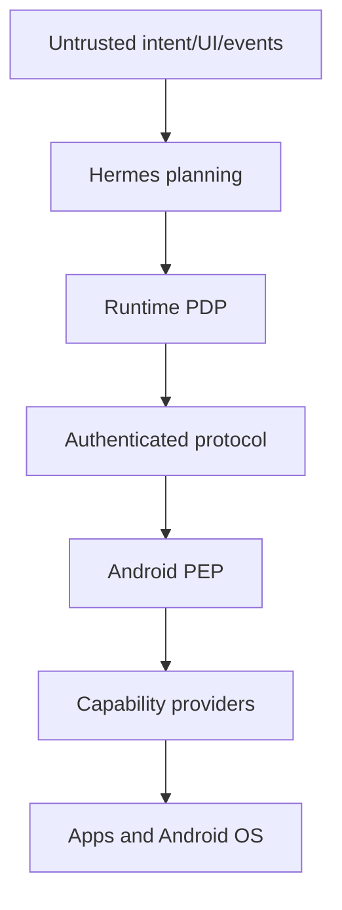

# Hermes Mobile Runtime Security

> Status: Phase 0 security architecture  
> Last reviewed: 2026-08-28  
> Security-sensitive implementation must not proceed without ADR-0003 and a reviewed threat model.

## 1. Security objective

Hermes Mobile Runtime controls a personal device through Accessibility, notifications, screenshots, Intent/native APIs and potentially future privileged providers. Compromise is comparable to remote desktop access plus access to private device context.

The system must ensure:

- only an enrolled Hermes instance can request operations;
- every operation is authorized for its exact parameters and device;
- sensitive actions require appropriate user confirmation/device authentication;
- all material actions are observable and auditable;
- UI, notifications, Skills, MCP and recovery cannot bypass policy;
- sensitive data is minimized, protected and deletable.

The open-source security findings motivating this design are recorded in [`docs/research/open-source-comparison.md`](docs/research/open-source-comparison.md).

## 2. Non-negotiable invariants

1. Deny by default for unknown tool, capability, app, Intent, protocol version or policy state.
2. Permission Gate is enforced both at Runtime and immediately before device execution.
3. No raw Android bridge endpoint is exposed to Hermes, Skills or MCP.
4. Confirmation tokens are single-use, short-lived and bound to device, request hash, tool, parameters and risk level.
5. Recovery cannot broaden scope, change sensitive parameters or reuse confirmation for a different action.
6. Release transport is encrypted and mutually authenticated; plaintext is test-only.
7. Shizuku/Shell is absent from V0.1.
8. Screen/notification/clipboard/contact/location/audio data is not written to ordinary logs.
9. Audit failure for L3–L5 fails the action closed.
10. A model statement such as “the user confirmed” is never authorization evidence.

## 3. Permission levels

| Level | Category | Examples | Default | Extra controls |
|---:|---|---|---|---|
| L0 | Read | screen/state/notifications/current app | Allow when configured | sensitivity filter, artifact retention |
| L1 | Navigation | open app, search, swipe, back/home | Allow when configured | app denylist, lock-screen restrictions |
| L2 | Modify | fill ordinary form, change non-sensitive preference | User configurable | preview/diff where possible |
| L3 | Communication | send message/email/comment, place call | Confirm | recipient/content binding; single-use token |
| L4 | Destructive/Financial | delete, purchase confirmation, payment, transfer | Always confirm | device authentication; amount/recipient binding; no recovery auto-repeat |
| L5 | System | APK install, privileged shell, security settings | Always confirm | device authentication, allowlist, separate capability provider, enhanced audit |

Risk is computed from the effective action, not the tool name. For example, tapping a “Send” button is L3 even though the primitive is `phone.tap`.

## 4. Threat model

### 4.1 Adversaries and failures

- Malicious or compromised Hermes server/plugin/MCP server.
- Prompt injection in visible UI text, notification content, webpage or message.
- Malicious Android app publishing deceptive Accessibility nodes or Intent handlers.
- Network attacker intercepting, replaying or modifying commands/state.
- Stolen or unlocked device and leaked pairing credentials.
- Compromised/poisoned Mobile Skill or dependency update.
- Accidental destructive behavior caused by stale state, duplicate execution or recovery.
- Sensitive data leakage through logs, screenshots, traces, crash reports or model prompts.
- OEM/Android behavior differences causing permission, overlay or service failures.

### 4.2 Trust boundaries

Everything left of a policy decision is untrusted input, including model output. Android UI text and notifications remain data; they cannot issue privileged instructions.

## 5. Authorization and confirmation

### 5.1 Policy decision

The Runtime Policy Decision Point evaluates:

- user/task identity and session;
- device identity and lock state;
- resolved semantic action and effective risk;
- exact normalized parameters;
- target app/package/recipient/domain;
- Skill provenance and declared permission;
- time, location or network policy if explicitly configured;
- previous confirmation and action history.

It outputs allow, deny or require-confirmation plus expiry, constraints and a request hash.

### 5.2 Device enforcement

The Android Policy Enforcement Point verifies:

- decision signature/MAC and enrolled issuer;
- device id, request id, tool and normalized parameter hash;
- expiry, nonce and replay cache;
- required Android permission/capability;
- confirmation/device-auth evidence when required.

If verification cannot complete, the action is denied. A bridge reconnect cannot silently resume an expired action.

### 5.3 Semantic risk upgrade

Before a coordinate/accessibility action, Observer should identify the target semantics when possible. If a generic tap resolves to Send/Delete/Pay/Install/Allow, risk is upgraded and the action returns `CONFIRMATION_REQUIRED`. Unknown critical targets fail closed.

## 6. Transport and device identity

- Use TLS/WSS by default; validate host identity.
- Enroll each device with a long-lived device key stored in Android Keystore.
- Use short-lived authenticated sessions with rotation and revocation.
- Protect commands with nonce/sequence and replay window.
- Separate development, staging and personal-device trust roots.
- Support explicit device unlink/revoke and lost-device response.
- Never place secrets in URLs, logs or crash reports.
- Do not rely on a six-character pairing code as ongoing authentication.
- Multi-device state, policy and audit are isolated by device id.

## 7. Data classification and handling

| Data | Default sensitivity | Handling |
|---|---:|---|
| App/package/activity | Internal | Audit allowed with retention limit |
| UI text/tree | Sensitive | Minimize, redact, protected artifact, no routine log |
| Screenshot/recording | Highly sensitive | Encrypt, access control, short retention, explicit capture indicator |
| Notifications/messages | Highly sensitive | Per-source filter, no default model persistence |
| Clipboard/contacts/location/audio | Highly sensitive | Feature-gated; least retention; explicit policy |
| Permission decisions | Security audit | Append-only, retain decision metadata, redact content |
| Skill traces | Sensitive | Parameterize/redact before validation storage |

`before_state` and `after_state` contain references and summaries. Artifact access is separately authorized and logged. Deleting a task or device must have a documented effect on retained sensitive artifacts.

## 8. UI and notification prompt injection

- Treat all observed text as untrusted content.
- Never parse observed text as a new system/developer instruction.
- Separate task intent from observation in model messages and structured data.
- Do not let notification payloads select arbitrary tools or permissions.
- Require allowlisted event rules or a new gated task for proactive execution.
- Detect transitions into banking, password manager, authenticator, security settings and package installer; apply deny/step-up policy.

## 9. Intent and app boundaries

- Prefer typed Intent adapters with explicit action/data/category schemas.
- Resolve and inspect target package before launch.
- Use allowlists for sensitive schemes and extras.
- Avoid implicit broadcasts and arbitrary extras in V0.1.
- Prevent exported-component abuse and Intent redirection.
- Re-observe foreground package/activity after Intent execution.

## 10. Shizuku and Shell

Shizuku/Shell is not part of V0.1. Future implementation requires all of:

- separate `system.*` provider and process boundary;
- L5 classification and device authentication;
- command/template allowlist, never arbitrary model-generated shell;
- fixed working directory and environment;
- timeout, output/size/resource limits and cancellation;
- package/path validation without broad destructive targets;
- complete command metadata audit with secret redaction;
- no network or filesystem expansion beyond the approved operation;
- explicit feature flag and supported-device policy.

## 11. Skills, MCP and supply chain

- Every Skill has provenance, version, content hash, permissions and validation evidence.
- Skill installation/update is reviewed; auto-learned candidates are quarantined.
- A Skill cannot call a higher-risk primitive than declared.
- MCP tools enter the same Router/Gate and cannot access raw bridge credentials.
- Pin upstream source SHAs and dependencies; preserve MIT/Apache notices.
- Generate SBOMs for Python, Gradle/APK, models and bundled assets separately.
- Treat Mobilerun Portal APK and model/data licenses as independent artifacts until proven otherwise.
- Sign release APKs; do not distribute unsigned debug builds as production.

## 12. Audit requirements

Each material operation records:

- task, intent reference and plan version;
- request/tool and normalized parameter digest;
- before/after state ids and transition summary;
- permission level, decision, policy version and confirmation id;
- executor/verification results, typed error and recovery attempts;
- timestamps, durations, device/runtime versions and correlation ids;
- artifact references and redaction metadata.

Audit is append-only. L3–L5 execution fails closed when required audit cannot be committed. The user must be able to answer what happened, why, which permission was used, when, and whether verification succeeded.

## 13. Recovery safety

- Retry only errors explicitly marked recoverable.
- Bound attempts, total time and navigation depth.
- Re-observe before each retry.
- Do not retry send/delete/pay/install/call automatically after ambiguous completion.
- A changed target, recipient, body, amount, package or permission invalidates confirmation.
- Escalate to replan or ask user when confidence falls below policy threshold.

## 14. Security tests required before Phase 1 exit

- Bypass attempts through Hermes tools, Skills, MCP and raw endpoints.
- Replay, expired token, wrong device and parameter tampering.
- Confirmation reuse and semantic risk upgrade.
- Malicious UI/notification prompt injection fixtures.
- Permission grant/revoke and device lock/unlock transitions.
- Intent hijack/redirect and unexpected foreground package.
- Artifact/log secret and personal-data leakage scans.
- Transport disconnect during action and ambiguous completion handling.
- Recovery attempting a higher-risk or modified action.

## 15. Vulnerability and incident handling

Until a full process is implemented:

1. Stop affected device sessions and revoke enrollment keys.
2. Preserve redacted audit metadata without copying sensitive artifacts.
3. Identify affected versions, tools, Skills and devices.
4. Disable the capability remotely only through authenticated policy configuration.
5. Patch with regression and bypass tests.
6. Rotate credentials and notify affected users when exposure is plausible.
7. Record a security ADR/postmortem without publishing exploitable private details prematurely.

Security questions and unresolved decisions must block the relevant capability rather than be left as runtime warnings.

